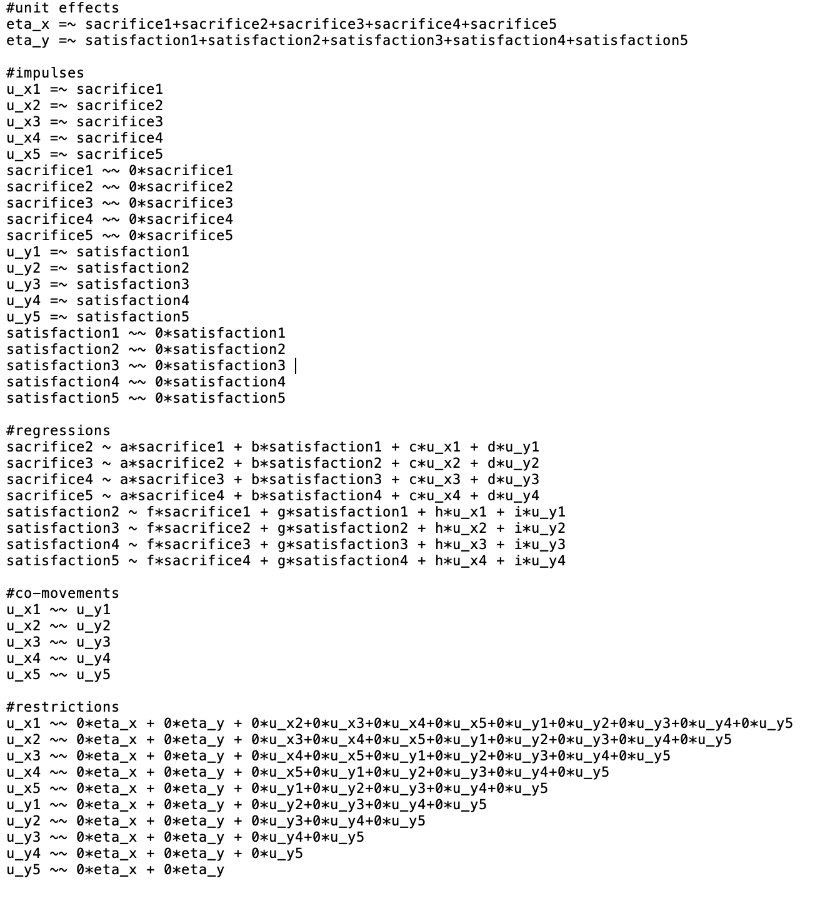

<!-- README.md is generated from README.Rmd. Please edit that file -->

# GCLM

<!-- badges: start -->

<!-- badges: end -->

The goal of GCLM is to help you write lavaan() script for fitting
generalized cross-lagged panel models (GCLM; Zyphur et al., 2019).
Currently, there is only one function for fitting the base GCLM, but new
functions and arguments may be added to automate the scripting of
short-run Granger-Sims tests, and long-run impulse responses.

## Installation

You can install the development version from
[GitHub](https://github.com/) with:

``` r
# install.packages("devtools")
devtools::install_github("jsakaluk/GCLM")
```

## Example

This is a basic example which shows you how to solve a common problem:

``` r
library(GCLM)
library(lavaan)
#> This is lavaan 0.6-3
#> lavaan is BETA software! Please report any bugs.
#Save/export script for GCLM between Sacrifice and Satisfaction over 5 waves
base.model <- gclm(xvar = "sacrifice", yvar = "satisfaction", waves = 5)
```

The function saves a lavaan() script for you to immediately submit to
its model-fitting functions (e.g., lavaan::sem()), and also outputs a
.txt document of the same script to the working directory.



``` r
base.model.fit <- sem(base.model, data = dat)
summary(base.model.fit)
```

Eventually, new functionality may be programmed to automate the tests of
short-run and long-run effects. Until then, users can manually ammend
this script and save as a new lavaan() script to conduct these
additional tests.
